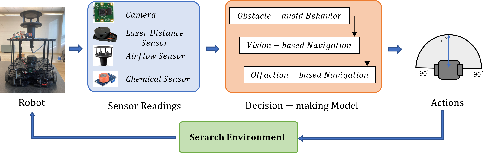

# 23_fusion_cp

# Integrating Vision and Olfaction via Multi-modal LLM for Robotic Odor Source Localization
> Code release for our [Sensors](https://www.mdpi.com/journal/sensors) publication.

[Project page]([https://sunzidhassan.github.io/24_LLMOSL/](https://sunzidhassan.github.io/23_fusion/)) | [Paper](https://www.mdpi.com/2740946)

[Sunzid Hassan](https://sunzid.com/) |
[Lingxiao Wang](https://lingxiaow.github.io/index/) |
[Khan Raqib Mahmud](https://scholar.google.com/citations?user=g64GPuIAAAAJ&hl=en) |


## 🔍 Framework Overview
<p align="center">
	
</p>
Odor Source Localization (OSL) technology allows autonomous agents like mobile robots to find an unknown odor source in a given environment. We proposed a Hierachical Control framework to control a robot finding the odor source by coordinating obstacle avoidance, vision-based navigation, and olfaction-based navigation behaviors.

## 🚀 Getting Started

### Hardware
We used the Turtlebot3 mobile robot for our experiment.


### 1. Hardware Setup ⚙️
Turtlebot3 mobile robot platform was used in this work. We paired a WindSonic Anemometer and MQ3 alcohol detector with the robot.

### 2. Software Setup ⚙️
This experiment uses Turtlebot3 waffle-pi running ROS Noetic. The software setup is included [Here](https://emanual.robotis.com/docs/en/platform/turtlebot3/quick-start/).
Workspace setup
```bash
mkdir catkin_ws && cd catkin_ws && mkdir src
catkin_make
nano ~/.bashrc and source ~/.bashrc
cd catkin_ws/src
catkin_create_pkg my_robot_controller rospy
```

Update the packages file `src/my_robot_controller/package.xml`:
```xml
<?xml version="1.0"?>
<package format="2">
  <name>my_robot_controller</name>
  <version>0.0.0</version>
  <description>The my_robot_controller package</description>

  <maintainer email="sunzid@todo.todo">sunzid</maintainer>
  <license>TODO</license>

  <!-- <author email="jane.doe@example.com">Jane Doe</author> -->

  <buildtool_depend>catkin</buildtool_depend>
  <build_depend>actionlib</build_depend>
  <build_depend>geometry_msgs</build_depend>
  <build_depend>move_base_msgs</build_depend>
  <build_depend>rospy</build_depend>
  <build_depend>sensor_msgs</build_depend>
  <build_depend>pytorch</build_depend>
  <build_depend>turtlesim</build_depend>
  <build_depend>turtlebot3_msgs</build_depend>
  <build_depend>nav_msgs</build_depend>
  <build_depend>tf</build_depend>
  <build_depend>tf2_msgs</build_depend>
  
  <build_export_depend>actionlib</build_export_depend>
  <build_export_depend>geometry_msgs</build_export_depend>
  <build_export_depend>move_base_msgs</build_export_depend>
  <build_export_depend>rospy</build_export_depend>
  <build_export_depend>sensor_msgs</build_export_depend>
  <build_export_depend>pytorch</build_export_depend>
  <build_export_depend>turtlesim</build_export_depend>
  <build_export_depend>turtlebot3_msgs</build_export_depend>
  <build_export_depend>nav_msgs</build_export_depend>
  <build_export_depend>tf</build_export_depend>
  <build_export_depend>tf2_msgs</build_export_depend>
  
  <exec_depend>actionlib</exec_depend>
  <exec_depend>geometry_msgs</exec_depend>
  <exec_depend>move_base_msgs</exec_depend>
  <exec_depend>rospy</exec_depend>
  <exec_depend>sensor_msgs</exec_depend>
  <exec_depend>pytorch</exec_depend>
  <exec_depend>turtlesim</exec_depend>
  <exec_depend>turtlebot3_msgs</exec_depend>
  <exec_depend>nav_msgs</exec_depend>
  <exec_depend>tf</exec_depend>
  <exec_depend>tf2_msgs</exec_depend>


  <export>
  </export>
</package>
```

### 3. Running the Algorithm 🏃
Note the IP address of the Turtlebot. Asumming the IP address is: 192.168.0.102

Open terminal and execute:
```bash
roscore
```

In a new terminal, execute:
```bash
ssh ubuntu@192.168.0.102 # password: turtlebot. Replace the IP address.
export TURTLEBOT3_MODEL=$waffle_pi
roslaunch turtlebot3_bringup turtlebot3_robot.launch
```

In a new terminal, execute:
```bash
ssh ubuntu@192.168.0.102 # password: turtlebot. Replace the IP address.
export TURTLEBOT3_MODEL=$waffle_pi
roslaunch turtlebot3_bringup turtlebot3_rpicamera.launch
```

In a new terminal, execute:
```bash
export TURTLEBOT3_MODEL=waffle_pi
roslaunch turtlebot3_navigation turtlebot3_navigation.launch map_file:=$HOME/turtlebot_slam_map/mapnew2.yaml #Replace the map directory and map file.
```
This will open rviz. Use 2D Pose Estimation and 2D Nav goal to fix map localization.

Make sure the navigation python file is executable (`chmod +x turtlebot_LLM_nav3.py`). Finally, in a new terminal, execute:
```bash
rosrun my_robot_controller turtlebot_LLM_nav3.py
```


## 🔖 Citation
```
 @article{hassan2024robotic,
        title={Robotic Odor Source Localization via Vision and Olfaction Fusion Navigation Algorithm},
        author={Hassan, Sunzid and Wang, Lingxiao and Mahmud, Khan Raqib},
        journal={Sensors},
        volume={24},
        number={7},
        pages={2309},
        year={2024},
        publisher={MDPI}
      }
```
